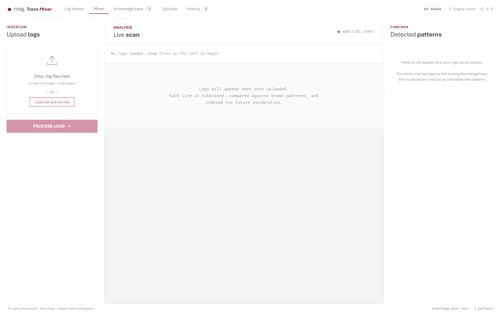
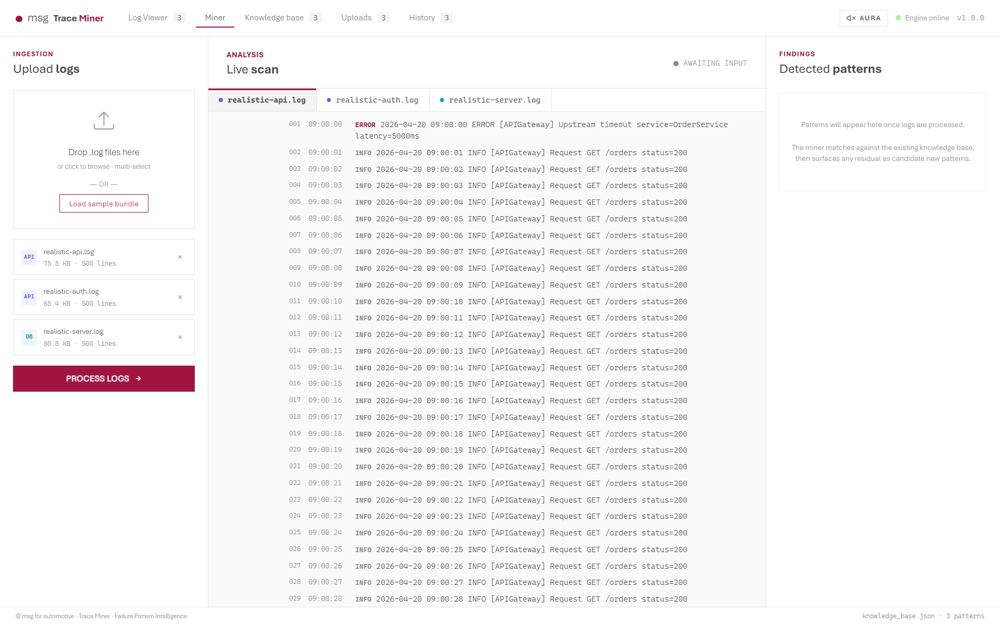
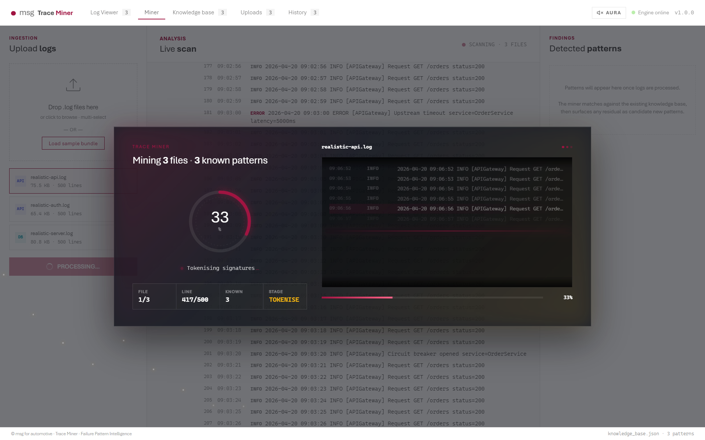
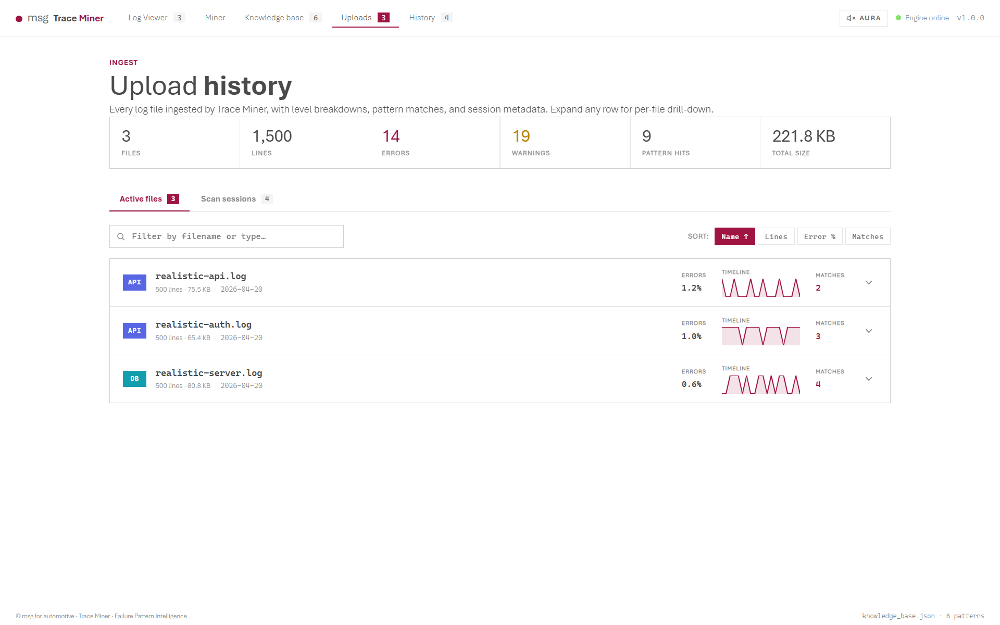
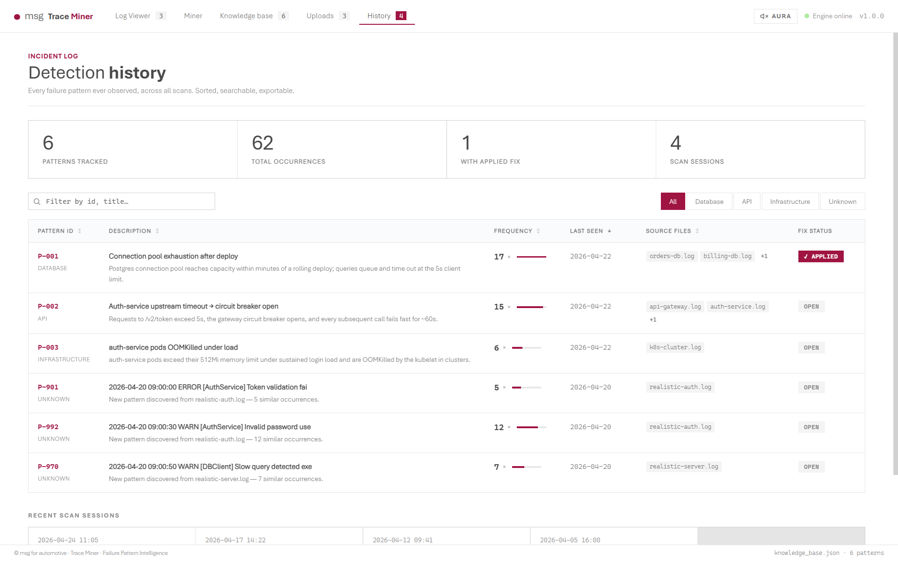
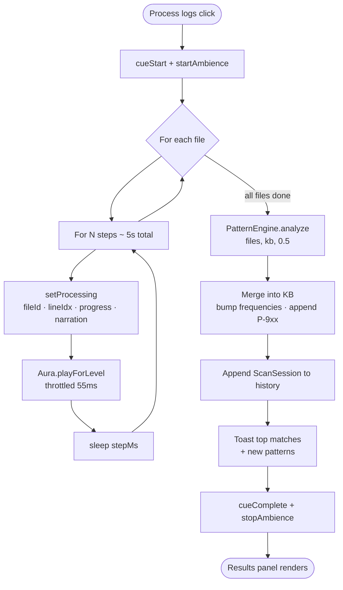

<div align="center">


**A zero-build, browser-native log analysis workbench for msg for automotive.**

<br>


<br>


</div>

---

## Overview

Trace Miner ingests raw log files, mines them for recurring failure patterns
using an in-browser TF-IDF + cosine-similarity engine, surfaces matches against
a growing knowledge base of past incidents, and presents everything — the scan
itself, the patterns, the reader, the history — as a single cinematic, cohesive
UI meant to replace point tools like LogExpert.

It is a **working interactive prototype**: no bundler, no transpile step, no
server-side code. React + Babel-Standalone run the app in the browser; all
state is in-memory for the lifetime of the tab.

---

## Contents

1.  [Screenshots](#screenshots)
2.  [Quick start](#quick-start)
3.  [What it does](#what-it-does)
4.  [Project layout](#project-layout)
5.  [Runtime architecture](#runtime-architecture)
6.  [Data model](#data-model)
7.  [The pattern engine](#the-pattern-engine)
8.  [Aura — log sonification & UI haptics](#aura--log-sonification--ui-haptics)
9.  [Tweaks panel](#tweaks-panel)
10. [Pages, in order of the UI](#pages-in-order-of-the-ui)
11. [Design system](#design-system)
12. [Extending the app](#extending-the-app)
13. [Known constraints](#known-constraints)
14. [Troubleshooting](#troubleshooting)
15. [Provenance](#provenance)

---

## Screenshots

A tour of the UI in the order a user typically hits each page. All captures
are against the bundled sample data so you can reproduce every view locally
via *Load sample bundle* → *Process logs*.

### Miner — empty state

<p align="center">
  
  <br/>
  <em>The landing view after boot. Left: ingestion panel with dropzone and <b>Load sample bundle</b>. Middle: live-scan area (empty). Right: Detected patterns findings panel (empty). The top bar exposes the five nav routes and the <b>AURA</b> audio-engine toggle.</em>
</p>

### Miner — after loading the sample bundle

<p align="center">
  
  <br/>
  <em>Three sample files (<code>realistic-api.log</code>, <code>realistic-auth.log</code>, <code>realistic-server.log</code>) tabbed across the scanner. Each parsed line shows its timestamp and level pill; the <b>Process logs</b> CTA is now armed.</em>
</p>

### Processing — ScanSplash overlay

<p align="center">
  
  <br/>
  <em>The fullscreen glassmorphic overlay that covers the viewport while <code>App.processLogs</code> runs. The progress ring shows aggregate completion across all files; the cycling narration (Parsing → Tokenising → Clustering → Matching → Computing → Finalizing) tracks the current stage. Four-stat bar: file index, line index, matches so far, current stage.</em>
</p>

### Log Viewer — full reader with time-travel scrubber

<p align="center">
  
  <br/>
  <em>The LogExpert replacement. Left: open files. Middle: search toolbar, ERROR / WARN / INFO level chips, the line stream with per-line level pills, and the <b>Time travel</b> dual-range scrubber backed by a 40-bucket ERROR/WARN/INFO density histogram. Right: selected-line inspector with the full raw message and the matched KB pattern if any.</em>
</p>

### Pattern detail — matched excerpt, suggested fix, applied-fix editor

<p align="center">
  
  <br/>
  <em>Drill-down for a single pattern (here <code>P-002 · API · Auth-service upstream timeout → circuit breaker open</code>). The matched log excerpt renders in a dark terminal block; below it sit the historical <b>Suggested fix</b>, the editable <b>Applied fix</b> block (writes back to the in-memory KB), and the <b>Human intervention</b> runbook. Aside: confidence donut, keyword chips, 6-week frequency timeline, and first/last-seen dates.</em>
</p>

### Uploads — active files with error-density sparklines

<p align="center">
  
  <br/>
  <em>Audit of every file currently loaded. 6-stat header (files / lines / errors / warnings / pattern hits / total size) over two sub-tabs: <b>Active files</b> (shown) with per-file type badge, line and size counts, error %, 20-bucket error-density sparkline, and match count; and <b>Scan sessions</b> for past runs. Filter by filename, sort by name / lines / error % / matches.</em>
</p>

### History — every pattern, sortable and filterable

<p align="center">
  
  <br/>
  <em>Institutional memory: every pattern ever observed across every scan. 4-stat header (patterns tracked, total occurrences, with applied fix, scan sessions). Filter by search + category. Each row shows <code>P-xxx</code>, description, frequency bar, last-seen date, source files, and an <b>APPLIED</b> / <b>OPEN</b> fix-status pill. Bottom strip: recent scan sessions.</em>
</p>

---

## Quick start

> **Why a server?** Opening `Trace Miner.html` directly via `file://` will fail.
> Babel-Standalone fetches the `<script type="text/babel">` sources, and
> browsers block `file://` fetches cross-origin. Any local HTTP server solves it.

Pick whichever runtime you already have — there's nothing to install for the
app itself. No `npm install`, no build, no transpile.

### Option 1 — Python (recommended, zero dependencies on Windows/macOS/Linux)

Python ships with a built-in static file server. From the project root:

```bash
# Python 3 (most systems)
python -m http.server 8080

# If `python` isn't on PATH but `py` is (Windows)
py -m http.server 8080

# On some Linux distros where python3 is the entry point
python3 -m http.server 8080
```

### Option 2 — Node.js (via `npx`, no install)

```bash
npx http-server -p 8080
# or
npx serve -l 8080 .
```

### Option 3 — Anything else that serves static files

`caddy file-server --listen :8080`, an nginx `root` block, `php -S 127.0.0.1:8080`,
VS Code's *Live Server* extension, etc. — they all work.

### Then open

```
http://127.0.0.1:8080/Trace%20Miner.html
```

First load runs a ~3.4 s cinematic boot sequence; after that the **Miner** page
is the home. From here, click *Load sample bundle* and hit *Process logs* to
see the full flow end-to-end without uploading anything.

<details>
<summary><b>One-liner shortcuts per platform</b></summary>

```bash
# Windows (PowerShell)
py -m http.server 8080 ; Start-Process "http://127.0.0.1:8080/Trace%20Miner.html"

# macOS
python3 -m http.server 8080 & open "http://127.0.0.1:8080/Trace%20Miner.html"

# Linux
python3 -m http.server 8080 & xdg-open "http://127.0.0.1:8080/Trace%20Miner.html"
```

</details>

---

## What it does

- **Reads log files.** Drag-drop `.log` / `.txt` / `.json`, use the file picker,
  or click *Load sample bundle* to get three realistic traces (api-gateway,
  orders-db, k8s-cluster).
- **Mines for failure patterns.** A TF-IDF-style keyword cosine similarity
  against the knowledge base classifies each error / warn line as either a
  match for a known pattern or a candidate for a new one. New clusters become
  `P-9xx` entries in the `unknown_logs` bucket.
- **Persists institutional knowledge.** Every pattern carries a suggested fix,
  a human-intervention runbook (severity, owner, escalation, avg time-to-
  resolution), and an editable **Applied Fix** block so the next engineer who
  hits it sees what worked last time.
- **Replaces LogExpert.** The Log Viewer is a full reader — search, level
  filters, bookmarks, tail mode, line inspector that surfaces matched KB
  patterns inline, and a dual-range **time-travel scrubber** with a severity
  histogram that dims lines outside the selected window and auto-scrolls the
  stream to follow.
- **Tracks the audit trail.** Uploads and History tabs show every file ever
  ingested, every scan session, level breakdowns, error-% sparklines,
  matched-pattern drill-downs, and applied-fix status — sortable and
  filterable.
- **Speaks.** Aura is an optional Web Audio sonification layer: subtle synth
  blips per log level during scans, ambient drone, per-element UI click
  haptics. No external audio files.

---

## Project layout

```
trace-miner/
  Trace Miner.html              entry point — loads React/Babel UMD + scripts
  tweaks-panel.jsx              reusable tweaks-panel shell (radio, toggle, slider...)
  README.md                     this file

  components/
    App.jsx                     root component — routing, toast bus, KB state
    BootScene.jsx               typewriter boot sequence
    Dashboard.jsx               Miner page — UploadPanel, Scanner, ResultsPanel,
                                plus the glassmorphic ScanSplash overlay
    LogViewer.jsx               full-featured log reader + TimeScrubber
    Pages.jsx                   PatternDetail, KnowledgeBase, History
    Uploads.jsx                 per-file drill-down + scan-session list
    Robot.jsx                   SVG robot (retained in bundle, not wired into
                                the current shell — kept as a swap-in asset)

  data/
    sample-logs.js              SAMPLE_LOGS, INITIAL_KB, SEED_HISTORY,
                                seeded applied-fix on P-001
    pattern-engine.js           tokenize, detectCategory, matchAgainstKB,
                                mineNewPatterns, analyze
    aura.js                     Web Audio engine + global haptic listener

  ds/
    colors_and_type.css         brand palette + Aptos @font-face + typography
    logo_msg.svg                msg wordmark
    logo_msg_white.svg          inverse wordmark
    fonts/
      Aptos.ttf  Aptos-Bold.ttf  Aptos-Light.ttf

  styles/
    app.css                     everything else — layout, scanner, splash,
                                log viewer, scrubber, KB, history, uploads,
                                motion, responsive breakpoints

  screenshots/                  reference captures from the design session
  uploads/                      design-time scratch uploads
```

All scripts are loaded as globals on `window`: `window.App`, `window.BootScene`,
`window.PatternEngine`, `window.Aura`, etc. This is the price of skipping the
bundler; it is intentional.

---

## Runtime architecture

```
                      ┌────────────────┐
                      │  Trace Miner   │
                      │    .html       │
                      │                │
                      │  loads React,  │
                      │  ReactDOM,     │
                      │  Babel (UMD),  │
                      │  then all JS   │
                      └───────┬────────┘
                              │
      ┌───────────────────────┼───────────────────────┐
      ▼                       ▼                       ▼
  data scripts          JSX components           app.css
  (define globals)      (register on window)     (styles)

  sample-logs.js  ──▶  SAMPLE_LOGS, INITIAL_KB, SEED_HISTORY
  pattern-engine  ──▶  PatternEngine.{analyze, matchAgainstKB, ...}
  aura.js         ──▶  Aura.{playForLevel, uiClick, ...} + global click listener

  tweaks-panel.jsx  ──▶  useTweaks, TweaksPanel, TweakSection, TweakRadio, ...

  BootScene       ──▶ window.BootScene
  Dashboard       ──▶ window.{UploadPanel, Scanner, ResultsPanel, PatternCard, ...}
  LogViewer       ──▶ window.LogViewer (+ internal TimeScrubber)
  Pages           ──▶ window.{PatternDetail, KnowledgeBase, History}
  Uploads         ──▶ window.UploadsPage
  App             ──▶ ReactDOM.createRoot(#root).render(<App/>)
```

### State ownership

All top-level state lives in `App.jsx`:

| State          | Type                          | Source of truth for                      |
|----------------|-------------------------------|------------------------------------------|
| `booted`       | `boolean`                     | Is the boot overlay dismissed            |
| `page`         | `'miner' \| 'viewer' \| 'kb' \| 'uploads' \| 'history' \| 'detail'` | Current route |
| `detailId`     | `string \| null`              | Which pattern the detail page is showing |
| `files`        | `File[]`                      | Every currently-loaded log file          |
| `processing`   | `object \| null`              | Live scanner tick (fileId, lineIdx, progress, narration) |
| `results`      | `AnalysisResult \| null`      | Output of the last `PatternEngine.analyze` |
| `kb`           | `KnowledgeBase`               | Mutable copy of `INITIAL_KB` — grows with new patterns & applied fixes |
| `history`      | `ScanSession[]`               | Seeded + appended each `processLogs` run |
| `toasts`       | `Toast[]`                     | Transient notifications                  |
| `tweakState`   | via `useTweaks()`             | accent color, log density, audio toggle  |

No external persistence. Refreshing the page resets everything to
`INITIAL_KB` + `SEED_HISTORY`. **Export as JSON** (Knowledge Base page) is how
you snapshot changes out.

### The scan loop

`App.processLogs()` drives the scan:



In pseudocode:

```
for each file:
  for N steps (capped so total ≈ 5s):
    setProcessing({fileId, lineIdx, progress, narration})  // drives UI
    Aura.playForLevel(line.level)                          // optional audio
    await sleep(stepMs)
run PatternEngine.analyze(files, kb, 0.5)
merge results into kb (bump frequencies, append new patterns)
append a ScanSession to history
emit toasts for top matches + new patterns
cueComplete + stopAmbience
```

The **Scanner** component on the Miner page tracks the same `processing` tick
and auto-scrolls the log stream to the active line. The **ScanSplash** is a
fullscreen overlay that renders only while `processing` is truthy.

---

## Data model

### Log file

```ts
{
  id: string          // unique per session
  name: string        // filename
  size: number        // bytes
  type: 'db' | 'api' | 'infra' | 'unknown'   // set by PatternEngine.detectCategory
  lines: LogLine[]
}

LogLine = {
  ts: string          // ISO-ish timestamp, may be '' for malformed lines
  level: 'ERROR' | 'FATAL' | 'WARN' | 'INFO' | 'DEBUG' | 'TRACE'
  msg: string         // the human-readable message
  raw: string         // untouched original line
}
```

Parsing is done by `Dashboard.parseLogText` / `LogViewer.handleUpload` — a
regex extracts the timestamp and level; everything else is the message.
Capped at 500 lines per file for the prototype.

### Knowledge base

```ts
KnowledgeBase = {
  database_logs: { patterns: Pattern[] }
  api_logs:      { patterns: Pattern[] }
  infra_logs:    { patterns: Pattern[] }
  unknown_logs:  { patterns: Pattern[] }
}

Pattern = {
  id: string                // e.g. 'P-001', new ones are 'P-9xx'
  title: string
  description: string
  keywords: string[]        // drives the match
  frequency: number         // times seen — bumped after each scan
  confidence: number        // 0..1
  category: 'database_logs' | 'api_logs' | 'infra_logs' | 'unknown_logs'
  first_seen: string        // YYYY-MM-DD
  last_seen: string
  source_files: string[]
  examples: string[]        // 1-2 illustrative log lines
  fix: string               // historical suggested remediation

  human_intervention?: {
    required: boolean
    owner: string
    severity: 'P0' | 'P1' | 'P2' | 'P3'
    runbook: string
    escalation: string
    avg_resolution_min: number | null
  }

  related_patterns?: string[]   // IDs that co-occur

  applied_fix?: {               // editable per-pattern
    text: string
    author: string
    saved_at: string            // 'YYYY-MM-DD HH:MM'
  }

  isNew?: boolean               // only on freshly mined patterns
}
```

### Scan session (history)

```ts
ScanSession = {
  when: string         // 'YYYY-MM-DD HH:MM'
  filesScanned: number
  matched: number
  newPatterns: number
  fileNames: string[]
}
```

---

## The pattern engine

`data/pattern-engine.js` exposes a single global `window.PatternEngine` with
five public functions. It is deliberately **explainable** — no black-box ML.

| Function                    | What it does                                              |
|-----------------------------|-----------------------------------------------------------|
| `tokenize(text)`            | Lowercase → strip punctuation → split → drop stopwords & short & numeric-only tokens |
| `detectCategory(lines)`     | Keyword-vote against `CATEGORY_HINTS` — returns `'database_logs'`, `'api_logs'`, `'infra_logs'`, or `'unknown_logs'` |
| `matchAgainstKB(lines, kb, threshold=0.55)` | For every ERROR/WARN/FATAL line, compute `cosineKeyword(text, pattern.keywords)` against each KB pattern; collect hits above threshold |
| `mineNewPatterns(unmatched, sourceFile)` | Group residual lines by a 3-token signature, emit a new `P-9xx` pattern per cluster with auto-generated metadata |
| `analyze(files, kb, threshold=0.5)` | Orchestrator — runs both per-file matching and new-pattern mining, aggregates hits across files |

### `cosineKeyword` — the scoring function

```
for each keyword (possibly multi-word):
  if all parts present in tokens → +1.0
  else if any part present       → +0.4
score = min(1, hits / (len(keywords) * 0.7))
```

It is not true cosine similarity on sparse vectors, but it *behaves* like one
against the hand-curated keyword lists: dense overlap saturates, partial
overlap accumulates linearly, zero overlap scores zero. Easy to reason about,
easy to explain to an SRE who asks "why did it match?"

### Thresholds

- `App.processLogs` calls `analyze(files, kb, 0.5)` for scans.
- `LogViewer` calls `matchAgainstKB(lines, kb, 0.5)` to paint matched lines.
- `Uploads` calls `matchAgainstKB(lines, kb, 0.5)` for per-file drill-downs.

---

## Aura — log sonification & UI haptics

`data/aura.js` is a self-contained Web Audio engine. First enable via either
the **Aura** button in the top-right of the shell or the Audio toggle in the
Tweaks panel — this lazily constructs an `AudioContext` and a master gain
node at 14%.

### Per-log-level (during scans)

| Level       | Sound                                                      |
|-------------|------------------------------------------------------------|
| ERROR/FATAL | Two warm plucks, 280 → 220 Hz sawtooth through lowpass     |
| WARN        | Soft triangle blip at 440 Hz                               |
| INFO        | Ultra-soft low sine click at 200 Hz, 15 ms                 |
| DEBUG/TRACE | Ghost tick at 2.4 kHz, 10 ms                               |
| other       | Generic 300 Hz sine                                        |

Throttled to one sound per 55 ms so dense streams don't smear.

### Scan-session cues

- `cueStart` — two-note rising sine (440 → 660 Hz)
- `startAmbience` / `stopAmbience` — 110 Hz sine with a 0.18 Hz LFO wobble, at 4% gain
- `cueMatch` — 880 Hz pluck when a pattern lands
- `cueComplete` — C5-E5-G5 arpeggio

### UI haptics (click-only — no hover sounds)

A single global `click` listener at capture phase walks a priority list of
selectors and picks a sound family. All pass through a lowpass filter and a
2-tap attack/decay envelope.

| Element                                      | Sound family                       |
|----------------------------------------------|------------------------------------|
| `.fi-remove`, `.tweaks-close`, `[data-haptic="remove"]` | low triangle thud (220 Hz)   |
| `.lv-bookmark`                               | rising chime (988 → 1318 Hz)       |
| `.topnav button`                             | grounded 740 Hz sine               |
| `.log-tab`, `.kb-cat`, `.hist-cat`           | tab-switch chime (620 → 820 Hz)    |
| `.lv-filter`                                 | 1100 Hz triangle                   |
| `.primary-btn`, `.af-save`                   | primary confirm (660 → 990 Hz)     |
| `.pattern-card`, `.related-card`, `.lv-file` | card-open 520 Hz sine              |
| `.toggle`, `[aria-pressed]`, `.lv-tail`, `.on` | rising/falling chime per state   |
| `.btn-sample`, `.btn-export`, `.scrub-reset`, `.af-edit` | secondary 980 Hz triangle |
| any other `button` / `[role="button"]`       | generic 1400 Hz click              |

Typing in a text input plays a 1800 Hz, 6 ms micro-tick per keystroke.

You can mark any element with `data-haptic="nav|tab|filter|primary|card|toggle|secondary|remove|bookmark"` to opt into a specific sound regardless of selector heuristics.

---

## Tweaks panel

Bottom-right, draggable, `backdrop-filter` glass. Hosted by `tweaks-panel.jsx`.

| Section       | Control          | Options                                 | Default       |
|---------------|------------------|-----------------------------------------|---------------|
| Appearance    | Accent color     | msg red, Teal, Blue                     | `red`         |
| Sample data   | Log density      | Sparse, Realistic, Heavy                | `realistic`   |
| Audio         | Log sonification | off / on                                | off           |

Density rewrites the loaded sample files in place: `sparse` truncates to 50%,
`heavy` duplicates lines until ~180% of original.

Accent colour flips `--accent` and `--accent-dark` on `<html>`, so every
component rewired to those vars (almost everything) recolours live.

---

## Pages, in order of the UI

### Boot scene
Full-viewport overlay. Dark backdrop, subtle noise + grid + vignette, msg
brand lockup, TRACE MINER wordmark, four typewritten console lines:

1. *Initializing Failure Pattern Miner · v1.0.0 · msg for automotive*
2. *Loading historical knowledge · knowledge_base.json · 3 patterns*
3. *Scanning log signatures · TF-IDF · cosine similarity*
4. *Ready · let's digitize. now. together.*

Stagger 620 ms, total ~3.4 s, then fades and mounts the shell.

### Miner
Three-column layout:

- **Upload panel** — dropzone + file picker + *Load sample bundle* + file list
  with type badge / size / line count / remove + *Process logs* CTA.
- **Scanner** — file-tab switcher + live log stream with the currently-scanned
  line highlighted. During `processing`, the **ScanSplash** overlay covers
  the whole viewport: blurred backdrop, floating particles, progress ring
  with percent, cycling system narration (Parsing → Tokenising → Clustering →
  Matching → Computing → Finalizing), streaming window of ~12 lines with
  ERROR keywords highlighted, horizontal scan-line sweep, 4-stat metrics bar.
- **Results panel** — 4-stat summary (matched, new, log hits, files) + a
  stack of PatternCards (known matches first, new patterns tagged *New*).

### Log Viewer
Sidebar (file list) + main (toolbar + stream + time scrubber) + details
(selected-line inspector).

- **Toolbar**: search box with `<mark>` in-message highlight, level filter
  chips (ERROR / WARN / INFO — clicking ERROR also toggles FATAL), showing /
  total counts, match count against KB, Tail toggle.
- **Stream**: line number, timestamp, level pill, message. Lines matching a
  KB pattern get a red left-edge bar; bookmarked lines keep a filled star;
  scan-line-dimmed lines fade to 18 %.
- **Time scrubber** (bottom of main): dual-range slider across the log's
  actual time span. Histogram behind the track shows ERROR/WARN/INFO density
  in 40 buckets. Drag either handle to narrow the window; drag the middle
  band to slide the window forward/backward at fixed width. The stream
  smoothly auto-scrolls to the first in-window line whenever the window
  changes. Lines without parseable timestamps always show.
- **Details pane**: timestamp, level, source file, full message in mono
  block, and if the line is a KB match a *MATCHED · P-xxx* card that opens
  the pattern detail. If no line selected, shows a bookmark digest.
- **Responsive**: ≤1100 px hides the details pane; ≤820 px collapses the
  sidebar into a horizontal top strip.

### Pattern detail
Two-column: main content + aside.

Main:
- Back button + `P-xxx · Category` badge + title + description.
- **Matched log excerpt** — dark terminal-styled lines using `pattern.examples`.
- **Suggested fix** — red-accent callout.
- **Applied fix** — editable `<textarea>` + author input + *Save to
  knowledge base*. Once saved, renders as a read-only card with author
  and saved-at timestamp, with an *Edit* affordance.
- **Human intervention** — KV table (required, severity pill, owner,
  runbook, escalation) + avg resolution footer.
- **Solutions from similar past incidents** — keyword-overlap related
  patterns with their historical fix text and, if present, the applied-fix
  summary from the previous incident.
- **Source files** — filenames + hit counts.

Aside:
- Confidence donut.
- Keyword chips (first two marked *hot*).
- Frequency timeline — pseudo-random 6-week bar chart derived from
  `pattern.frequency`.
- Observed block — first / last seen, total occurrences.

### Knowledge base
Search box + 4 category tabs (Database / API / Infrastructure / Unknown).
Grid of PatternCards. Top-right: **Export knowledge_base.json** — downloads
the full in-memory KB as a pretty-printed JSON file.

### Uploads
6-stat header (files, lines, errors, warnings, pattern hits, total size).
Two sub-tabs:

- **Active files** — one expandable card per loaded file. Collapsed view:
  type badge, name, line count, size, first-line date, error %, 20-bucket
  sparkline of error density, match count. Expanded: level breakdown bars,
  temporal profile KV, matched pattern list (click-through), *Remove from
  session* button.
- **Scan sessions** — every `processLogs` run with timestamp, file count,
  matched vs. new counts, and the full file list as chips.

Filter by filename/type, sort by name / lines / error % / match count.

### History
Header stats (patterns tracked, total occurrences, with applied fix, scan
sessions).
Filter bar: search + category pills (All / DB / API / Infra / Unknown).
Sortable table: Pattern ID · Description · Frequency (bar + count) · Last
seen · Source files · Fix status (Applied / Open pill).
Recent scan sessions grid below the table.

### Toasts
Top-right stack, 4.2 s auto-dismiss, 260 ms exit animation. Emitted by
`App.pushToast` on scan completion (matched / new) and applied-fix save.

---

## Design system

Defined in `ds/colors_and_type.css`.

### Colours

| Token              | Value       | Usage                                            |
|--------------------|-------------|--------------------------------------------------|
| `--msg-red`        | `#A01441`   | Default accent — logo dot, active links, ERROR  |
| `--msg-gray`       | `#6F6F6F`   | Wordmark, primary text tint                     |
| `--msg-petrol`     | `#56A3BC`   | Secondary accent, robot eyes                    |
| `--accent`         | live        | Flipped by the accent-color tweak               |
| `--accent-dark`    | live        | Dark variant of the accent                      |

Runtime accents (`App` writes them on `<html>`):

| Tweak  | `--accent` | `--accent-dark` |
|--------|------------|-----------------|
| red    | `#A01441`  | `#84103A`       |
| teal   | `#139EAD`  | `#0E7F8C`       |
| blue   | `#5866E3`  | `#3F4CC9`       |

### Typography

- **Display / body**: `Aptos` (regular + bold, both in `ds/fonts/`).
- **Light**: `Aptos Light` for boot lockup + supporting text.
- **Mono**: system mono stack (used for IDs, timestamps, code-ish bits).

`local()` is tried first so machines with Microsoft 365's installed Aptos pick
it up; otherwise the bundled TTFs from `ds/fonts/` serve.

### Motion

- Boot lines type at 22 ms/char; stagger between lines is 620 ms.
- Scan splash cycles system messages every 1100 ms with a fade+slide.
- Pattern / history / KB rows have a staggered fade-in on mount.
- Page transitions at 240–640 ms `cubic-bezier(0.4, 0, 0.2, 1)`.
- **`prefers-reduced-motion: reduce`** disables non-essential motion
  (streams still scroll, animations collapse to instant).

---

## Extending the app

### Add a pattern to the default KB

Edit `data/sample-logs.js` → add to the relevant bucket in `INITIAL_KB`.
Include `keywords` that will actually appear in matching log lines — the
match function does whole-token matching, partial-credit on multi-word
keywords.

### Add a new source of logs

Drop a file into the dropzone, or extend `SAMPLE_LOGS` with another entry
so *Load sample bundle* picks it up.

### Plug in a real backend

Replace the in-memory `kb` state with a fetch to your service, and the
`setKb` callback in `App.processLogs` + `App.saveFix` with a POST. The rest
of the UI is already reactive to `kb` changes.

### Add a new UI haptic

Either:
1. Add a new selector branch to the click listener in `data/aura.js`, or
2. Tag the element with `data-haptic="..."` and handle it in the switch.

### Add a new page

1. Write a new component in `components/` that registers `window.YourPage`.
2. Add `<script type="text/babel" src="components/YourPage.jsx?v=N"/>` to
   `Trace Miner.html`.
3. Add a nav button in `App.jsx`'s `<nav className="topnav">` and a case
   in the `page === 'yours'` render block.

### Customise the tweaks panel

Any control from `tweaks-panel.jsx` works: `TweakSection`, `TweakRadio`,
`TweakToggle`, `TweakSlider`, `TweakColor`, `TweakSelect`. Add a key to the
`DEFAULTS` object in `App.jsx` and a `<TweakXxx>` in the `<TweaksPanel>`
block.

---

## Known constraints

- **In-memory only.** Everything resets on refresh. Export the KB as JSON to
  save changes; there is no import yet.
- **500-line cap per file.** `parseLogText` slices inputs so the UI stays
  responsive — sufficient for demos, not for multi-megabyte production logs.
- **Timestamp parser is strict.** It expects `YYYY-MM-DD[T ]HH:MM:SS[.ms][Z|±hh:mm]`.
  Lines without matching timestamps still parse — they just don't participate
  in the time scrubber.
- **Must be served over HTTP.** Babel-Standalone cannot fetch `.jsx` files
  over `file://` in modern browsers.
- **Single-tab only.** No cross-tab coordination; two open tabs are two
  independent sessions.
- **Match quality is keyword-bounded.** A pattern with poor or missing
  `keywords` won't match well. Treat the keyword list as the source of truth
  for recall — not the description.

---

## Troubleshooting

<details>
<summary><b>The page is blank / scripts don't load.</b></summary>

You probably opened `Trace Miner.html` via a `file://` path. Serve it over
HTTP instead — see [Quick start](#quick-start). Open DevTools → Console and
you should see a clear CORS or "failed to fetch" error confirming this.

</details>

<details>
<summary><b><code>python -m http.server</code> says "Address already in use".</b></summary>

Port `8080` is taken by another process. Either stop that process or pick a
different port:

```bash
python -m http.server 5173
# then open http://127.0.0.1:5173/Trace%20Miner.html
```

</details>

<details>
<summary><b>No audio on first click of the Aura button.</b></summary>

Browsers only allow `AudioContext` to start after a user gesture. The first
click *creates* the context; the second click onwards produces sound. This
is a Chrome/Firefox autoplay-policy safeguard, not a bug in Aura.

</details>

<details>
<summary><b>My log file loaded but no lines show in the time scrubber.</b></summary>

The scrubber only considers lines whose timestamps match
`YYYY-MM-DD[T ]HH:MM:SS[.ms][Z|±hh:mm]`. Lines with other timestamp formats
still appear in the stream, but don't participate in the histogram or the
range slider. Reformat the source log or extend the regex in
`Dashboard.parseLogText` / `LogViewer.handleUpload`.

</details>

<details>
<summary><b>A pattern I expect to match isn't matching.</b></summary>

Matching is keyword-bounded. Open the pattern in the **Knowledge Base** page
and check the `keywords` list — the match function does whole-token matching
(with partial credit for multi-word keywords) and the score must clear `0.5`.
Add a more distinctive keyword from a real matched line and re-scan.

</details>

<details>
<summary><b>Changes I made to the KB disappeared.</b></summary>

All state is in-memory. Use **Export knowledge_base.json** on the Knowledge
Base page before refreshing. There is no import path yet — see
[Extending the app](#extending-the-app) for wiring a real backend.

</details>

<details>
<summary><b>Fonts look wrong / fall back to system sans.</b></summary>

The bundled Aptos TTFs live in `ds/fonts/`. `ds/colors_and_type.css` tries
`local('Aptos')` first, then the bundled files. If you moved `ds/` or served
from a different root, the relative `url(...)` paths in that CSS will 404 —
keep `ds/` a sibling of `Trace Miner.html`.

</details>

---

## Provenance

This implementation was handed off from a Claude Design session
(claude.ai/design). The original design bundle (`uoOuLuHZLGP3Jd_a_vcpSw`)
contained the prototype in `HTML/CSS/JS`; this working copy was produced by
reading the README and chat transcripts, reading every file in full, and
materialising the complete project, with one font-path fix in
`ds/colors_and_type.css` so the bundled Aptos TTFs resolve correctly from
inside the CSS file.
